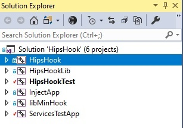

# 第二节 工程结构说明

HipsHook工程总共包含有六个项目，如下图所示：

## 1. HipsHook项目

本项目编译目标为HipsHook.dll文件，此dll会被注入到被监控的进程中。HipsHook.dll的目的是根据Json配置文件进行Windows API Hook，并且把监控过程中监控到的信息生成日志并发回给服务器端（目前为FortiTracer项目[^1]）。

## 2. HipsHookLib项目

本项目编译目标为HipsHookLib.lib文件，此lib文件被HipsHook项目和HipsHookTest项目使用。本项目中包含了HipsHook工程最主要的源代码文件，源代码结构说明请见[第三节](SECTION3.md)。

## 3. HipsHookTest项目

本项目编译目标为HipsHookTest.exe文件，本项目包含所有的单元测试代码和benchmark性能测试代码，可以运行最终生成的exe文件来执行这些测试项目。测试的最终目的是保证HipsHook的主要功能在压力测试的情况下工作正常，稳定并且性能良好。

## 4. Inject App项目

本项目编译目标为Inject.exe文件，本项目包含在Ring3层远程线程注入和APC注入两种注入方式的源代码。你可以使用Inject.exe实现以下功能：

 **（1）在32位Windows系统下将HipsHook.dll注入32位样本**

 **（2）在64位Windows系统下将HipsHook.dll注入32位样本**

 **（3）在64位Windows系统下将HipsHook.dll注入64位样本**

## 5. libMinHook项目

本项目编译目标为libMinHook.x32.lib文件，本项目是第三方开源项目minhook[^2]的修改版。项目中包含了API Hook的实现代码，HipsHookLib项目使用了该项目的lib文件。

## 6. ServiceTestApp项目

本项目编译目标为ServiceTest.exe文件，该文件是HipsHookTest项目的辅助测试文件，根据不同的测试目的，目前通过命令行设置可以让该exe做为服务运行，或者以normal方式运行。

**（1）--services 选项，exe将作为服务运行，HipsHookTest项目可以运行该服务来测试服务API的钩子运行情况**

**（2）--normal 选项，exe将以normal方式运行，HipsHookTest项目可以运行该程序来进行注入的测试**

[^1]: FortiTracer项目是FortiSandbox工程中的主要项目，负责监控样本的行为并最终输出到日志文件当中，日志文件由RatingEngine打分并最终将样本归类。 
[^2]: minhook开源项目地址：https://github.com/TsudaKageyu/minhook

------

