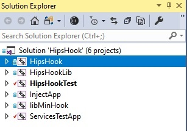

# 1.2 Project Structure

Currently, there are in total of six projects in the HipsHook Solution, as shown in the figure below.

## 1. HipsHook

The build output of the HipsHook project is HipsHook.dll, which will be injected into the monitored process. HipsHook.dll will create hooks for Windows APIs according to the JSON files, and send the monitoring information back to the "server" (i.e. FortiTracer[^1]).

## 2. HipsHookLib

The build output of the HipsHookLib project is HipsHookLib.lib, which will be used by the HipsHook and HipsHookTest projects. This project includes the code for the main functionalities. For more information, please refer to [HipsHook Project](SECTION3.md).

## 3. HipsHookTest

The build output of the HipsHookTest project is HipsHookTest.exe, which includes all the unit tests and benchmark tests. The purpose of this project is to ensure correctness, performance and stability under the stress tests.

## 4. InjectApp

The build output of the InjectApp project is Inject.exe. This project includes the functionalities of Ring3 remote thread injection and APC injection. You can realize the following with Inject.exe:

 **(1) Inject HipsHook.dll into a 32-bit sample under 32-bit system**

 **(2) Inject HipsHook.dll into a 32-bit sample under 64-bit system**

 **(3) Inject HipsHook.dll into a 64-bit sample under 64-bit system**

## 5. libMinHook

The libMinHook project is a modified version of a third-party open-source project, minhook[^2], and the build output of it is libMinHook.x32.lib. This project includes the functionality of the API hook, and the lib file is used in the HipsHookLib project.

## 6. ServiceTestApp

The build output of the ServiceTestApp project is ServiceTest.exe, which is a support file for tests in the HipsHookTest project. You can run the .exe file with the following command-line options:

**(1) --services: The .exe file will be executed as a service, which can be used by HipsHookTest project to test the hooks for the Service APIs**

**(2) --normal: The .exe file will be executed as a normal executable, which can be used by HipsHookTest project to perform the injection test (please refer to the InjectApp section)**

[^1]: FortiTracer is the main part of FortiSandbox, which monitors sample behaviours and record them through TracerLog (.log) files. The TracerLog file will be used in the Rating Engine to score and categorize samples.
[^2]: Link to minhook: https://github.com/TsudaKageyu/minhook

------

